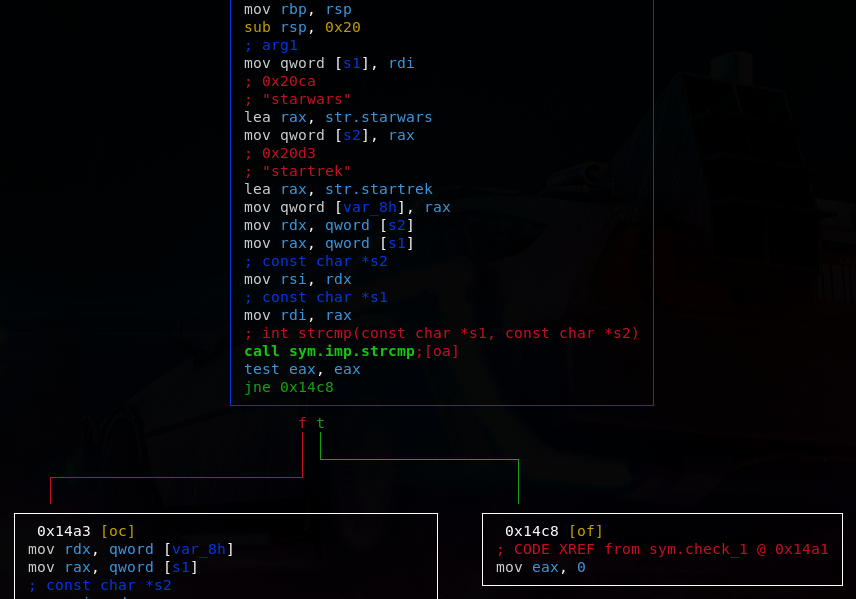
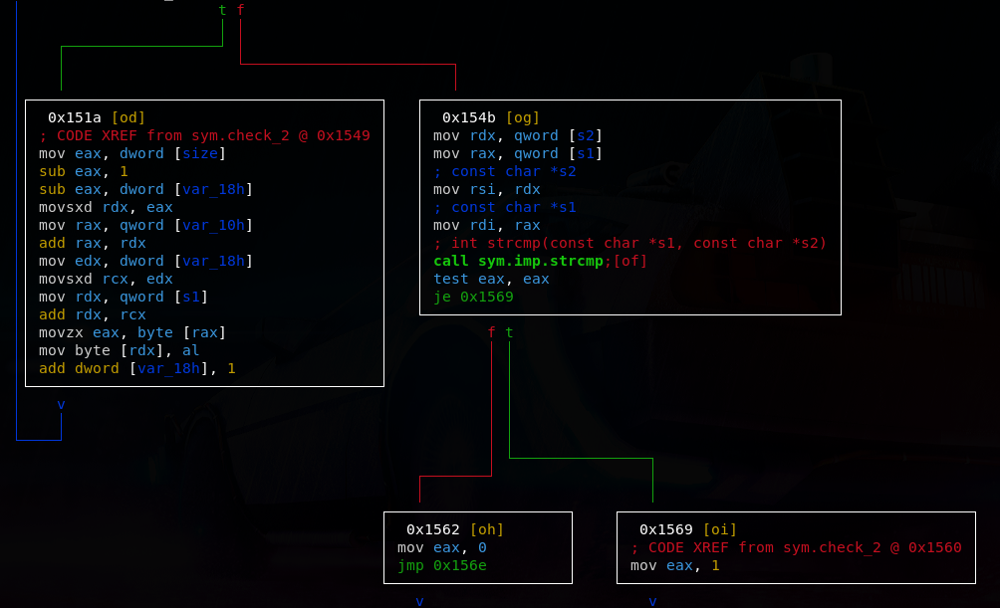
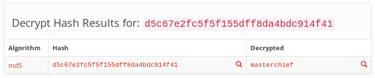
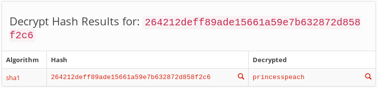

# AUCTF 2020
<div align="center"></div>

AUCTF 2020 has ended, and me and my team [**P1rates**](https://ctftime.org/team/113157) really enjoyed it as it was full of good problems, I participated as **T1m3-m4ch1n3** and here's my writeup about some of the problems that i solved.
*(if you're interested in the rest you can read the writeup of my teammate **y4mm1** [here](https://ah-sayed.github.io/posts/auctf-2020))*

## Challenges

| Title                           	      | Category      |
| --------------------------------------------|--------------:|
| [Cracker Barrel](#cracker-barrel)	      |   Reversing   |
| [Mr. Game and Watch](#mr-game-and-watch)    |   Reversing   |
| [Sora](#sora)      		   	      |   Reversing   |
| [Don't Break Me](#don't-break-me)	      |   Reversing   |
| [Thanksgiving Dinner](#thanksgiving-dinner) |   Pwn         |

---

## Cracker Barrel
#### Reversing

### Description:
> **I found a USB drive under the checkers board at cracker barrel. My friends told me not to plug it in but surely nothing bad is on it?<br>
> I found this file, but I can't seem to unlock it's secrets. Can you help me out?<br><br>
> Also.. once you think you've got it I think you should try to connect to challenges.auctf.com at port 30000 not sure what that means, but it written on the flash drive..<br>
> [cracker_barrel](cracker%20barrel/cracker_barrel)**

### Solution:

Firstly we start by `strings` command and obviously the flag isn't there so we do `file` command we will find it's ELF 64-bit, dynamically linked and not stripped.<br>

let's do some radare2 stuff
```
$ r2 -AA cracker_barrel
[0x00001180]> afl
```

well, here we find some interesting function names like:
```
main
sym.check
sym.check_1
sym.check_2
sym.check_3
sym.print_flag
```

then seeking to the main and entering the visual mode:
```
[0x00001180]> s main
[0x000012b5]> VV
```

we notice that main calls sym.check and then `test eax, eax` and the `je` if it's false then it calls sym.print_flag .. So whatever happens inside check() function it MUST return a non-zero value so we can get the flag!

By digging into check() function we see clearly the it takes the user input and calls check_1() function and if the return is zero it returns zero (which we don't need to happend), Otherwise it continues to call the second check which is check_2() and so on with check_3() .. so we need to make sure to return a non-zero value from these functions too

Now going deeper inside check_1():

<div align="center"></div>

as we see clearly it takes the user input in s1 variable, then "starwars" in s2 and compares them if they're equal then it goes to the second check which compares the user input with "startrek" if they're NOT equal it returns 1

So all we need to do is passing "starwars" as first input and by that we passed the first check!

Now we go to check_2() function in visual mode we'll find there's a string "si siht egassem terces" that get modified by some operations and then compared to our second input

<div align="center"></div>

as seen in the photo above we can make a breakpoint in the `cmp` instruction and examine the 2 strings
I'll use gdb for the debugging:
```
$ gdb cracker_barrel
(gdb) set disassembly-flavor intel
(gdb) disass check_2
   ..
   0x0000000000001553 <+132>:	mov    rsi,rdx
   0x0000000000001556 <+135>:	mov    rdi,rax
   0x0000000000001559 <+138>:	call   0x1130
   ..

(gdb) b *check_2+138
Breakpoint 1 at 0x1559

(gdb) r
Give me a key!
starwars
You have passed the first test! Now I need another key!
AAAA

Breakpoint 1, 0x0000555555555559 in check_2 ()
```

Now we hit the breakpoint on the comparing point now by examining rsi and rdi:
```
(gdb) x/wx $rsi
0x7fffffffc540:	0x41414141
(gdb) x/2wx $rdi
0x555555559420:	0x73692073	0x00000000
```

Clearly rsi is our input and rdi is how our input must be! which represents "s is" as a string (in little endian)!
And this our second input!

Now heading to our final check which is check_3 function() in visual mode .. we se a string "z!!b6~wn&\`" passed seperately to variables
then it iterates through each character in the user input string and encrypt it as follows:

<div align="center"></div>

The encryption method:
- take each character and add 0x2 to its hexadecimal value
- XOR the result with 0x14

And then compare the n-th character in the resulting string with the n-th character in "z!!b6\~wn&\`" string.
Our goal now is clear which is to decrypt "z!!b6\~wn&\`" string:
```python
secret = "z!!b6~wn&`"
result = ""

for c in secret:
    result += chr((ord(c) ^ 0x14) - 0x2)

print(result)
```

Now by running it:
```bash
$ python3 decrypt.py
l33t hax0r
```

And that's our third input!
Now by connecting to the server to get the flag:
```
$ nc challenges.auctf.com 30000
Give me a key!
starwars
You have passed the first test! Now I need another key!
s is
Nice work! You've passes the second test, we aren't done yet!
l33t hax0r
Congrats you finished! Here is your flag!
auctf{w3lc0m3_to_R3_1021}
```

Flag: `auctf{w3lc0m3_to_R3_1021}`

---

## Mr. Game and Watch
#### Reversing

### Description:
> **My friend is learning some wacky new interpreted language and different hashing algorithms. He's hidden a flag inside this program but I cant find it...<br><br>
> He told me to connect to challenges.auctf.com 30001 once I figured it out though.<br>
> [mr_game_and_watch.class](mr.%20game%20and%20watch/mr_game_and_watch.class)**

### Solution:
First, we need to decompile the .class file to get its java source .. i used [CFR java decompiler](https://www.benf.org/other/cfr/):

```bash
$ java -jar ~/cfr-0.149.jar mr_game_and_watch.class > mr_game_and_watch.java
```

and this was the resulting source code:

```java
import java.io.BufferedReader;
import java.io.FileReader;
import java.io.IOException;
import java.security.MessageDigest;
import java.util.Arrays;
import java.util.Scanner;

public class mr_game_and_watch {
    public static String secret_1 = "d5c67e2fc5f5f155dff8da4bdc914f41";
    public static int[] secret_2 = new int[]{114, 118, 116, 114, 113, 114, 36, 37, 38, 38, 120, 121, 33, 36, 37, 113, 117, 118, 118, 113, 33, 117, 121, 37, 119, 34, 118, 115, 114, 120, 119, 114, 36, 120, 117, 120, 38, 114, 35, 118};
    public static int[] secret_3 = new int[]{268, 348, 347, 347, 269, 256, 348, 269, 256, 256, 344, 271, 271, 264, 266, 348, 257, 266, 267, 348, 269, 266, 266, 344, 267, 270, 267, 267, 348, 349, 349, 265, 349, 267, 256, 269, 270, 349, 268, 271, 351, 349, 347, 269, 349, 271, 257, 269, 344, 351, 265, 351, 265, 271, 346, 271, 266, 264, 351, 349, 351, 271, 266, 266};
    public static int key_2 = 64;
    public static int key_3 = 313;

    public static void main(String[] arrstring) {
        System.out.println("Welcome to the Land of Interpreted Languages!");
        System.out.println("If you are used to doing compiled languages this might be a shock... but if you hate assembly this is the place to be!");
        System.out.println("\nUnfortunately, if you hate Java, this may suck...");
        System.out.println("Good luck!\n");
        if (mr_game_and_watch.crackme()) {
            mr_game_and_watch.print_flag();
        }
    }

    private static boolean crackme() {
        Scanner scanner = new Scanner(System.in);
        if (mr_game_and_watch.crack_1((Scanner)scanner) && mr_game_and_watch.crack_2((Scanner)scanner) && mr_game_and_watch.crack_3((Scanner)scanner)) {
            System.out.println("That's correct!");
            scanner.close();
            return true;
        }
        System.out.println("Nope that's not right!");
        scanner.close();
        return false;
    }

    private static boolean crack_1(Scanner scanner) {
        System.out.println("Let's try some hash cracking!! I'll go easy on you the first time. The first hash we are checking is this");
        System.out.println("\t" + secret_1);
        System.out.print("Think you can crack it? If so give me the value that hashes to that!\n\t");
        String string = scanner.nextLine();
        String string2 = mr_game_and_watch.hash((String)string, (String)"MD5");
        return string2.compareTo(secret_1) == 0;
    }

    private static boolean crack_2(Scanner scanner) {
        System.out.println("Nice work! One down, two to go ...");
        System.out.print("This next one you don't get to see, if you aren't already digging into the class file you may wanna try that out!\n\t");
        String string = scanner.nextLine();
        return mr_game_and_watch.hash((String)string, (String)"SHA1").compareTo(mr_game_and_watch.decrypt((int[])secret_2, (int)key_2)) == 0;
    }

    private static boolean crack_3(Scanner scanner) {
        System.out.print("Nice work! Here's the last one...\n\t");
        String string = scanner.nextLine();
        String string2 = mr_game_and_watch.hash((String)string, (String)"SHA-256");
        int[] arrn = mr_game_and_watch.encrypt((String)string2, (int)key_3);
        return Arrays.equals(arrn, secret_3);
    }

    private static int[] encrypt(String string, int n) {
        int[] arrn = new int[string.length()];
        for (int i = 0; i < string.length(); ++i) {
            arrn[i] = string.charAt(i) ^ n;
        }
        return arrn;
    }

    private static String decrypt(int[] arrn, int n) {
        Object object = "";
        for (int i = 0; i < arrn.length; ++i) {
            object = (String)object + (char)(arrn[i] ^ n);
        }
        return object;
    }

    private static void print_flag() {
        String string = "flag.txt";
        try (BufferedReader bufferedReader = new BufferedReader(new FileReader(string));){
            String string2;
            while ((string2 = bufferedReader.readLine()) != null) {
                System.out.println(string2);
            }
        }
        catch (IOException iOException) {
            System.out.println("Could not find file please notify admin");
        }
    }

    public static String hash(String string, String string2) {
        String string3 = null;
        try {
            MessageDigest messageDigest = MessageDigest.getInstance(string2);
            byte[] arrby = messageDigest.digest(string.getBytes("UTF-8"));
            StringBuilder stringBuilder = new StringBuilder(2 * arrby.length);
            for (byte by : arrby) {
                stringBuilder.append(String.format("%02x", by & 0xFF));
            }
            string3 = stringBuilder.toString();
        }
        catch (Exception exception) {
            System.out.println("broke");
        }
        return string3;
    }
}
```

After reading the source code we clearly see that in order to call print_flag() function crackme() function MUST return true which will happen only if crack_1(), crack_2() and crack_3() functions are true .. So let's make those guys true!

- crack_1():
``` java
    private static boolean crack_1(Scanner scanner) {
        System.out.println("Let's try some hash cracking!! I'll go easy on you the first time. The first hash we are checking is this");
        System.out.println("\t" + secret_1);
        System.out.print("Think you can crack it? If so give me the value that hashes to that!\n\t");
        String string = scanner.nextLine();
        String string2 = mr_game_and_watch.hash((String)string, (String)"MD5");
        return string2.compareTo(secret_1) == 0;
    }
```

That's easy .. the input gets encrypted using MD5 and then compared to secret_1 variable if they're equal it returns true
we need to decrypt secret_1 value and that will be our first key!

I used this [site](https://hashtoolkit.com/decrypt-hash/) for that:

<div align="center"></div>

Nice! `masterchief` is our first input we got one .. two to go!

- crack_2():
```java
    private static boolean crack_2(Scanner scanner) {
        System.out.println("Nice work! One down, two to go ...");
        System.out.print("This next one you don't get to see, if you aren't already digging into the class file you may wanna try that out!\n\t");
        String string = scanner.nextLine();
        return mr_game_and_watch.hash((String)string, (String)"SHA1").compareTo(mr_game_and_watch.decrypt((int[])secret_2, (int)key_2)) == 0;
    }
```

Well, here it takes our input -> encrypt it using SHA1 -> compare it to the decrypted secret_2 value using decrypt() function

Now by thinking reverse! we need to: decrypt secret_2 value -> decrypt the result using SHA1 -> and that's our input!

The equivalent python code of decrypt() function is:

```python
secret = [114, 118, 116, 114, 113, 114, 36, 37, 38, 38, 120, 121, 33, 36, 37, 113, 117, 118, 118, 113, 33, 117, 121, 37, 119, 34, 118, 115, 114, 120, 119, 114, 36, 120, 117, 120, 38, 114, 35, 118]

key = 64

def decrypt(a, k):
    result = ""
    for i in range (0, len(a)):
        result += chr(a[i] ^ k)

    return result

print(decrypt(secret, key))
```

Now running it:

```bash
$ python3 decrypt.py
264212deff89ade15661a59e7b632872d858f2c6
```

Now decrypting this SHA1 using the same [site](https://hashtoolkit.com/decrypt-hash/):

<div align="center"></div>

Great! `princesspeach` is our second input .. only one left!

- crack_3():
```java

    private static boolean crack_3(Scanner scanner) {
        System.out.print("Nice work! Here's the last one...\n\t");
        String string = scanner.nextLine();
        String string2 = mr_game_and_watch.hash((String)string, (String)"SHA-256");
        int[] arrn = mr_game_and_watch.encrypt((String)string2, (int)key_3);
        return Arrays.equals(arrn, secret_3);
    }
```

So it takes our input -> encrypt it using SHA256 -> encrypt it using encrypt() function -> compare the result with secret_3 array

thinking reverse we should: take the secret_3 array -> decrypt it using the reverse of encrypt() function -> decrypt the resulting SHA256 hash

The encrypt() function just XOR each character with 313 value and that's the equivalent python code:
```python
secret = [268, 348, 347, 347, 269, 256, 348, 269, 256, 256, 344, 271, 271, 264, 266, 348, 257, 266, 267, 348, 269, 266, 266, 344, 267, 270, 267, 267, 348, 349, 349, 265, 349, 267, 256, 269, 270, 349, 268, 271, 351, 349, 347, 269, 349, 271, 257, 269, 344, 351, 265, 351, 265, 271, 346, 271, 266, 264, 351, 349, 351, 271, 266, 266]

key = 313

def decrypt(a, n):
    myStr = ""
    for i in range (0, len(a)):
        myStr += chr(a[i] ^ key)

    return myStr

print(decrypt(secret, key))
```

Now running it:
```bash
$ python3 decrypt2.py
5ebb49e499a6613e832e433a2722edd0d2947d56fdb4d684af0f06c631fdf633
```

Then i used this [site](https://md5decrypt.net/en/Sha256/) to decrypt the result:

<div align="center"></div>

Finally! Our third input is `solidsnake`

Now connecting to the server:
```
$ nc challenges.auctf.com 30001

Welcome to the Land of Interpreted Languages!
If you are used to doing compiled languages this might be a shock... but if you hate assembly this is the place to be!

Unfortunately, if you hate Java, this may suck...
Good luck!

Let's try some hash cracking!! I'll go easy on you the first time. The first hash we are checking is this
	d5c67e2fc5f5f155dff8da4bdc914f41
Think you can crack it? If so give me the value that hashes to that!
	masterchief
Nice work! One down, two to go ...
This next one you don't get to see, if you aren't already digging into the class file you may wanna try that out!
	princesspeach
Nice work! Here's the last one...
	solidsnake
That's correct!
auctf{If_u_h8_JAVA_and_@SM_try_c_sharp_2922}
```

Flag: `auctf{If_u_h8_JAVA_and_@SM_try_c_sharp_2922}`

---

## Sora
#### Reversing

### Description:
> **This obnoxious kid with spiky hair keeps telling me his key can open all doors.<br>
> Can you generate a key to open this program before he does?<br><br>
> Connect to challenges.auctf.com 30004<br>
> [sora](sora/sora)**

### Solution:

